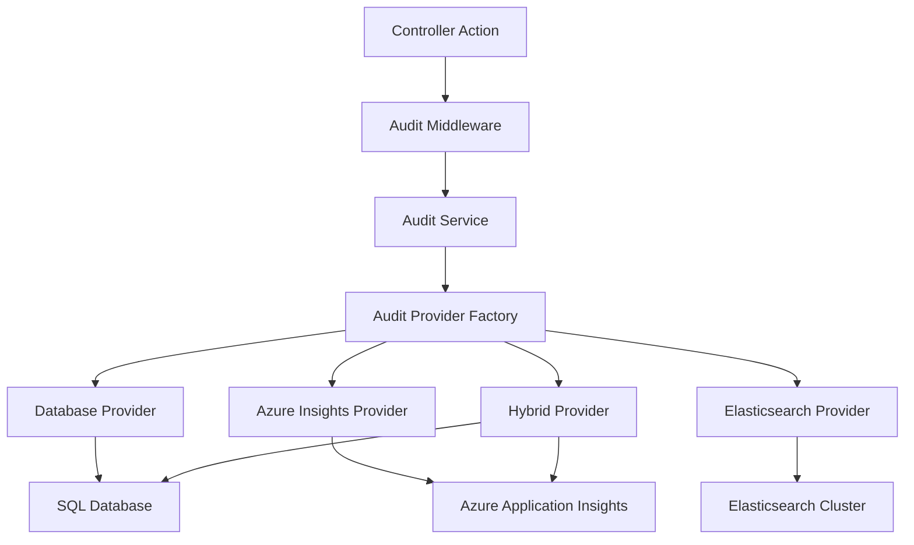

# Generic Audit Logging Middleware Design

## Overview

This document outlines the design for a generic, configurable audit logging middleware that can be used across the entire application, not just for feature toggles. This approach provides consistency, flexibility, and maintainability.

## Architecture Benefits

### ✅ **Advantages of Generic Audit Middleware**

1. **Single Responsibility**: One system handles all audit logging
2. **Provider Flexibility**: Easy to switch between Database, Azure Insights, Elasticsearch, etc.
3. **Consistency**: All audit entries follow the same schema and format
4. **Performance**: Optimized with batching, async processing, and buffering
5. **Compliance**: Centralized system easier to audit and certify
6. **Maintainability**: Single codebase to maintain and update
7. **Extensibility**: Easy to add new entity types and actions

### ❌ **Problems with Domain-Specific Audit Tables**

1. **Code Duplication**: Every domain needs its own audit implementation
2. **Inconsistent Schemas**: Different teams create different audit formats
3. **Maintenance Overhead**: Multiple systems to maintain and update
4. **Query Complexity**: Need to join multiple tables for comprehensive reports
5. **Provider Lock-in**: Hard to change logging providers later
6. **Performance Issues**: Multiple audit systems competing for resources

## Audit Middleware Architecture

### Core Components



### Implementation Details

#### 1. Audit Entry Model

```csharp
public class AuditEntry
{
    public Guid AuditId { get; set; } = Guid.NewGuid();
    public string EntityType { get; set; } // "TenantFeature", "User", "Shop", etc.
    public string EntityId { get; set; } // Primary key or composite key
    public string Action { get; set; } // "CREATE", "UPDATE", "DELETE", "ENABLE", "DISABLE"
    public Guid UserId { get; set; }
    public string UserName { get; set; }
    public Guid? TenantId { get; set; }
    public string TenantName { get; set; }
    public DateTime Timestamp { get; set; } = DateTime.UtcNow;
    public object Changes { get; set; } // Before/After object
    public Dictionary<string, object> Metadata { get; set; } // Additional context
    public Guid? CorrelationId { get; set; } // For tracing related operations
    public string IpAddress { get; set; }
    public string UserAgent { get; set; }
}
```

#### 2. Audit Service Interface

```csharp
public interface IAuditService
{
    Task LogAsync(string entityType, string entityId, string action,
                 object beforeState = null, object afterState = null,
                 Guid? userId = null, Guid? tenantId = null,
                 Dictionary<string, object> metadata = null,
                 Guid? correlationId = null);

    Task LogAsync(AuditEntry entry);

    Task<List<AuditEntry>> GetAuditLogAsync(AuditQuery query);

    Task<AuditStatistics> GetAuditStatisticsAsync(DateTime startDate, DateTime endDate);
}

public class AuditQuery
{
    public string EntityType { get; set; }
    public string EntityId { get; set; }
    public Guid? UserId { get; set; }
    public Guid? TenantId { get; set; }
    public DateTime? StartDate { get; set; }
    public DateTime? EndDate { get; set; }
    public List<string> Actions { get; set; }
    public int Page { get; set; } = 1;
    public int PageSize { get; set; } = 50;
}
```

#### 3. Provider Strategy Pattern

```csharp
public interface IAuditProvider
{
    Task WriteAsync(AuditEntry entry);
    Task WriteBatchAsync(IEnumerable<AuditEntry> entries);
    Task<List<AuditEntry>> ReadAsync(AuditQuery query);
    Task<long> CountAsync(AuditQuery query);
    Task<AuditStatistics> GetStatisticsAsync(DateTime startDate, DateTime endDate);
}

public interface IAuditProviderFactory
{
    IAuditProvider CreateProvider(string providerName);
    IAuditProvider CreateProvider(AuditProviderType providerType);
}

public enum AuditProviderType
{
    Database,
    AzureInsights,
    Elasticsearch,
    Hybrid,
    File,
    Memory // For testing
}
```

#### 4. Provider Implementations

##### Database Provider

```csharp
public class DatabaseAuditProvider : IAuditProvider
{
    private readonly IDbConnectionFactory _connectionFactory;
    private readonly ILogger<DatabaseAuditProvider> _logger;
    private readonly DatabaseAuditOptions _options;

    public async Task WriteAsync(AuditEntry entry)
    {
        const string sql = @"
            INSERT INTO AuditLog (AuditId, EntityType, EntityId, Action, UserId, UserName,
                                TenantId, TenantName, Timestamp, Changes, Metadata,
                                CorrelationId, IpAddress, UserAgent)
            VALUES (@AuditId, @EntityType, @EntityId, @Action, @UserId, @UserName,
                   @TenantId, @TenantName, @Timestamp, @Changes, @Metadata,
                   @CorrelationId, @IpAddress, @UserAgent)";

        using var connection = await _connectionFactory.CreateConnectionAsync();
        await connection.ExecuteAsync(sql, entry);
    }

    public async Task WriteBatchAsync(IEnumerable<AuditEntry> entries)
    {
        // Bulk insert implementation for performance
        using var connection = await _connectionFactory.CreateConnectionAsync();
        using var transaction = await connection.BeginTransactionAsync();

        try
        {
            foreach (var batch in entries.Batch(_options.BatchSize))
            {
                await connection.ExecuteAsync(InsertSql, batch, transaction);
            }
            await transaction.CommitAsync();
        }
        catch
        {
            await transaction.RollbackAsync();
            throw;
        }
    }
}
```

##### Azure Application Insights Provider

```csharp
public class AzureInsightsAuditProvider : IAuditProvider
{
    private readonly TelemetryClient _telemetryClient;
    private readonly ILogger<AzureInsightsAuditProvider> _logger;

    public async Task WriteAsync(AuditEntry entry)
    {
        var telemetry = new EventTelemetry("AuditLog");

        telemetry.Properties["EntityType"] = entry.EntityType;
        telemetry.Properties["EntityId"] = entry.EntityId;
        telemetry.Properties["Action"] = entry.Action;
        telemetry.Properties["UserId"] = entry.UserId.ToString();
        telemetry.Properties["UserName"] = entry.UserName;
        telemetry.Properties["TenantId"] = entry.TenantId?.ToString();
        telemetry.Properties["Changes"] = JsonSerializer.Serialize(entry.Changes);
        telemetry.Properties["Metadata"] = JsonSerializer.Serialize(entry.Metadata);

        if (entry.CorrelationId.HasValue)
        {
            telemetry.Context.Operation.Id = entry.CorrelationId.Value.ToString();
        }

        _telemetryClient.TrackEvent(telemetry);
        await Task.CompletedTask; // Insights is fire-and-forget
    }
}
```

##### Hybrid Provider

```csharp
public class HybridAuditProvider : IAuditProvider
{
    private readonly DatabaseAuditProvider _databaseProvider;
    private readonly AzureInsightsAuditProvider _insightsProvider;
    private readonly ILogger<HybridAuditProvider> _logger;

    public async Task WriteAsync(AuditEntry entry)
    {
        var tasks = new List<Task>
        {
            _databaseProvider.WriteAsync(entry), // For compliance and querying
            _insightsProvider.WriteAsync(entry)  // For real-time monitoring
        };

        try
        {
            await Task.WhenAll(tasks);
        }
        catch (Exception ex)
        {
            _logger.LogError(ex, "Failed to write audit entry to one or more providers");
            // Don't throw - audit logging shouldn't break the main flow
        }
    }

    public async Task<List<AuditEntry>> ReadAsync(AuditQuery query)
    {
        // Always read from database for consistency
        return await _databaseProvider.ReadAsync(query);
    }
}
```

#### 5. Audit Middleware

```csharp
public class AuditMiddleware
{
    private readonly RequestDelegate _next;
    private readonly IAuditService _auditService;
    private readonly ILogger<AuditMiddleware> _logger;
    private readonly AuditOptions _options;

    public async Task InvokeAsync(HttpContext context)
    {
        // Set correlation ID for request tracing
        var correlationId = Guid.NewGuid();
        context.Items["CorrelationId"] = correlationId;
        context.Response.Headers.Add("X-Correlation-ID", correlationId.ToString());

        // Check if this endpoint should be audited
        var endpoint = context.GetEndpoint();
        var auditAttribute = endpoint?.Metadata.GetMetadata<AuditableAttribute>();

        if (auditAttribute == null)
        {
            await _next(context);
            return;
        }

        // Capture request information
        var requestBody = await CaptureRequestBodyAsync(context.Request);
        var beforeState = await CaptureBeforeStateAsync(context, auditAttribute);

        await _next(context);

        // Only log successful operations (2xx status codes)
        if (context.Response.StatusCode >= 200 && context.Response.StatusCode < 300)
        {
            _ = Task.Run(async () =>
            {
                try
                {
                    var afterState = await CaptureAfterStateAsync(context, auditAttribute);

                    await _auditService.LogAsync(new AuditEntry
                    {
                        EntityType = auditAttribute.EntityType,
                        EntityId = auditAttribute.EntityId ?? ExtractEntityIdFromContext(context),
                        Action = auditAttribute.Action,
                        UserId = GetCurrentUserId(context),
                        UserName = GetCurrentUserName(context),
                        TenantId = GetCurrentTenantId(context),
                        Changes = new { Before = beforeState, After = afterState },
                        Metadata = new Dictionary<string, object>
                        {
                            ["RequestBody"] = requestBody,
                            ["RequestPath"] = context.Request.Path,
                            ["RequestMethod"] = context.Request.Method,
                            ["StatusCode"] = context.Response.StatusCode
                        },
                        CorrelationId = correlationId,
                        IpAddress = GetClientIpAddress(context),
                        UserAgent = context.Request.Headers["User-Agent"]
                    });
                }
                catch (Exception ex)
                {
                    _logger.LogError(ex, "Failed to write audit log entry");
                }
            });
        }
    }
}
```

#### 6. Auditable Attribute

```csharp
[AttributeUsage(AttributeTargets.Method | AttributeTargets.Class)]
public class AuditableAttribute : Attribute
{
    public string EntityType { get; set; }
    public string EntityId { get; set; } // Optional: can be extracted from route/context
    public string Action { get; set; }
    public bool CaptureRequestBody { get; set; } = true;
    public bool CaptureResponseBody { get; set; } = false;

    public AuditableAttribute(string entityType, string action)
    {
        EntityType = entityType;
        Action = action;
    }
}
```

### Usage Examples

#### Feature Toggle Controller

```csharp
[ApiController]
[Route("api/Tenants/{tenantId}/Features")]
public class TenantFeaturesController : ControllerBase
{
    [HttpPost("{featureId}/enable")]
    [Auditable("TenantFeature", "ENABLE")]
    public async Task<IActionResult> EnableFeature(Guid tenantId, Guid featureId,
                                                  [FromBody] EnableFeatureRequest request)
    {
        // Business logic here
        var result = await _featureService.EnableFeatureForTenantAsync(tenantId, featureId, CurrentUserId, request.Reason);
        return Ok(result);
    }

    [HttpPost("{featureId}/disable")]
    [Auditable("TenantFeature", "DISABLE")]
    public async Task<IActionResult> DisableFeature(Guid tenantId, Guid featureId,
                                                   [FromBody] DisableFeatureRequest request)
    {
        var result = await _featureService.DisableFeatureForTenantAsync(tenantId, featureId, CurrentUserId, request.Reason);
        return Ok(result);
    }
}
```

#### Manual Audit Logging

```csharp
public class UserService
{
    private readonly IAuditService _auditService;

    public async Task UpdateUserAsync(Guid userId, UpdateUserRequest request)
    {
        var beforeState = await GetUserAsync(userId);

        // Perform update
        await _repository.UpdateUserAsync(userId, request);

        var afterState = await GetUserAsync(userId);

        // Manual audit logging for complex scenarios
        await _auditService.LogAsync(
            entityType: "User",
            entityId: userId.ToString(),
            action: "UPDATE",
            beforeState: beforeState,
            afterState: afterState,
            metadata: new Dictionary<string, object>
            {
                ["UpdatedFields"] = GetChangedFields(beforeState, afterState),
                ["RequestSource"] = "UserManagement"
            }
        );
    }
}
```

## Configuration and Setup

### Dependency Injection Registration

```csharp
public static class AuditingServiceExtensions
{
    public static IServiceCollection AddAuditing(this IServiceCollection services,
                                                IConfiguration configuration)
    {
        var options = configuration.GetSection("AuditLogging").Get<AuditOptions>();
        services.Configure<AuditOptions>(configuration.GetSection("AuditLogging"));

        // Register providers
        services.AddScoped<DatabaseAuditProvider>();
        services.AddScoped<AzureInsightsAuditProvider>();
        services.AddScoped<ElasticsearchAuditProvider>();
        services.AddScoped<HybridAuditProvider>();

        // Register factory and service
        services.AddScoped<IAuditProviderFactory, AuditProviderFactory>();
        services.AddScoped<IAuditService, AuditService>();

        // Background service for batch processing
        services.AddHostedService<AuditProcessingService>();

        return services;
    }

    public static IApplicationBuilder UseAuditing(this IApplicationBuilder app)
    {
        return app.UseMiddleware<AuditMiddleware>();
    }
}
```

### Configuration Options

```csharp
public class AuditOptions
{
    public string Provider { get; set; } = "Database";
    public Dictionary<string, object> ProviderOptions { get; set; } = new();
    public List<string> EnabledEntityTypes { get; set; } = new();
    public int RetentionDays { get; set; } = 2555; // 7 years
    public bool EnableMetadataCapture { get; set; } = true;
    public bool EnableRequestBodyCapture { get; set; } = true;
    public bool EnableResponseBodyCapture { get; set; } = false;
    public int BatchSize { get; set; } = 100;
    public TimeSpan FlushInterval { get; set; } = TimeSpan.FromSeconds(30);
    public int MaxQueueSize { get; set; } = 10000;
}
```

## Performance Optimizations

### 1. Async Background Processing

```csharp
public class AuditProcessingService : BackgroundService
{
    private readonly IServiceProvider _serviceProvider;
    private readonly Channel<AuditEntry> _auditQueue;
    private readonly AuditOptions _options;

    protected override async Task ExecuteAsync(CancellationToken stoppingToken)
    {
        await foreach (var entries in _auditQueue.Reader.ReadAllAsync(stoppingToken)
                                                        .Buffer(_options.BatchSize)
                                                        .WithCancellation(stoppingToken))
        {
            using var scope = _serviceProvider.CreateScope();
            var auditProvider = scope.ServiceProvider.GetRequiredService<IAuditProvider>();

            try
            {
                await auditProvider.WriteBatchAsync(entries);
            }
            catch (Exception ex)
            {
                // Log error but don't stop processing
                _logger.LogError(ex, "Failed to write audit batch");
            }
        }
    }
}
```

### 2. Memory Caching for Lookups

```csharp
public class CachedAuditService : IAuditService
{
    private readonly IAuditService _inner;
    private readonly IMemoryCache _cache;

    public async Task<List<AuditEntry>> GetAuditLogAsync(AuditQuery query)
    {
        var cacheKey = $"audit_{query.GetHashCode()}";

        if (_cache.TryGetValue(cacheKey, out List<AuditEntry> cached))
        {
            return cached;
        }

        var result = await _inner.GetAuditLogAsync(query);
        _cache.Set(cacheKey, result, TimeSpan.FromMinutes(5));

        return result;
    }
}
```

## Benefits Summary

### ✅ **Why Generic Audit Middleware is Superior**

1. **Consistency**: All audit entries follow the same schema
2. **Flexibility**: Easy to switch providers (DB → Azure Insights → Elasticsearch)
3. **Performance**: Optimized with batching and async processing
4. **Maintainability**: Single system to maintain and update
5. **Compliance**: Centralized audit trail easier to certify
6. **Extensibility**: Easy to add new entity types and providers
7. **Testing**: Single audit system to mock and test
8. **Monitoring**: Centralized audit monitoring and alerting

### 🎯 **Recommended Implementation**

For the feature toggles project, use the generic audit middleware approach because:

1. **Future-Proof**: When you add more features (user management, shop management, etc.), they'll all use the same audit system
2. **Provider Flexibility**: Start with database, easily switch to Azure Insights later
3. **Compliance**: Easier to meet regulatory requirements with consistent audit trail
4. **Performance**: Single optimized audit pipeline vs. multiple domain-specific ones
5. **Development Speed**: Teams don't need to implement their own audit logic

This approach provides a solid foundation that will serve the entire application, not just feature toggles.
